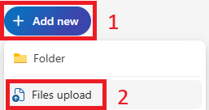

# Verwendung von Beispieldaten mit Microsoft 365 Copilot

In diesen Labs erstellen wir Prompts für Microsoft 365 Copilot, die auf die folgenden Dateien verweisen:

- [Promotion Plan for Chai Tea in Latin America.docx](https://go.microsoft.com/fwlink/?linkid=2269126)
- [Market Analysis Report for Mystic Spice Premium Chai Tea.docx](https://go.microsoft.com/fwlink/?linkid=2268826)
- [Contoso Chai Tea market trends 2023.xlsx](https://go.microsoft.com/fwlink/?linkid=2268822)

Um sicherzustellen, dass diese Dateien später von Microsoft 365 Copilot zugänglich sind, laden wir sie zuerst auf OneDrive hoch.

## Hochladen von Dateien in OneDrive

Führen Sie die folgenden Schritte aus, um alle erforderlichen Dateien auf **OneDrive** hochzuladen:

1. Melden Sie sich mit dem Kennwort `Pa55w.rd` beim virtuellen Computer an, der von Ihrem Mandanten-Anbieter bereitgestellt wird, und zwar als lokales **Administrator**-Konto.

2. Wählen Sie in der Windows-Taskleiste **Microsoft Edge** aus.

3. Geben Sie in der Adressleiste `https://onedrive.live.com/login` ein.

4. Wählen Sie unter **Willkommen bei Microsoft 365** die Option **Anmelden** aus.

5. Geben Sie bei der **Anmeldeaufforderung** userx@yourtenant.onmicrosoft.com (von Ihrem Mandanten bereitgestellt) ein und wählen Sie **Weiter**.

6. Geben Sie auf dem Bildschirm **Kennwort eingeben** „Password1“ ein (das Sie von Ihrem Mandanten erhalten haben) und wählen Sie dann **Anmelden**.

7. Wenn Sie aufgefordert werden, **Angemeldet zu bleiben**, wählen Sie **Dies nicht mehr anzeigen** und dann **Ja**.

8. Wählen Sie in **OneDrive** in der oberen linken Ecke **+** (neu hinzufügen) > **Datei hochladen**.

    

9. Wählen Sie im **Datei-Explorer** **Dieser PC** > **Lokaler Datenträger (C:)** und öffnen Sie den Ordner **ResourceFiles**.

10. Markieren Sie alle Dateien im Ordner **ResourceFiles** und wählen Sie dann **Öffnen**, um sie auf **OneDrive** hochzuladen.

11. Wenn der Upload abgeschlossen ist, sollten Sie unten in der Mitte des Bildschirms **29 Elemente in Meine Dateien hochgeladen** sehen.

12. Lassen Sie **Edge** geöffnet und gehen Sie zur nächsten Aufgabe über.

### Verweisen auf Dateien

Wenn Sie auf Dateien von Copilot verweisen, stellen Sie möglicherweise fest, dass Sie einige Dateien aus den Vorschlägen, die Ihnen zur Verfügung gestellt werden, nicht finden können. Dies passiert manchmal, weil bestimmte Erfahrungen mit Copilot nur auf Dateien aus der Liste der zuletzt verwendeten Dateien (MRU) verweisen, während andere es Ihnen ermöglichen, OneDrive zu durchsuchen, um Ihre Datei zu finden. Das Hinzufügen zu dieser Liste ist so einfach wie das Öffnen in der entsprechenden Microsoft 365-App.  Nachdem sie geöffnet wurden, sollten sie in der MRU-Liste angezeigt werden.

> [!IMPORTANT]
> Microsoft 365 Copilot funktioniert nur mit Dateien, die auf OneDrive gespeichert sind. Wenn Dateien lokal auf Ihrem PC gespeichert sind, müssen Sie diese auf OneDrive verschieben, um Copilot zu aktivieren.

Im weiteren Verlauf haben Sie die Möglichkeit, andere Prompts mit diesen Dateien auszuprobieren, und wir empfehlen Ihnen, dies zu tun, um Ihre Prompt-Fähigkeiten zu erforschen und zu verbessern.
